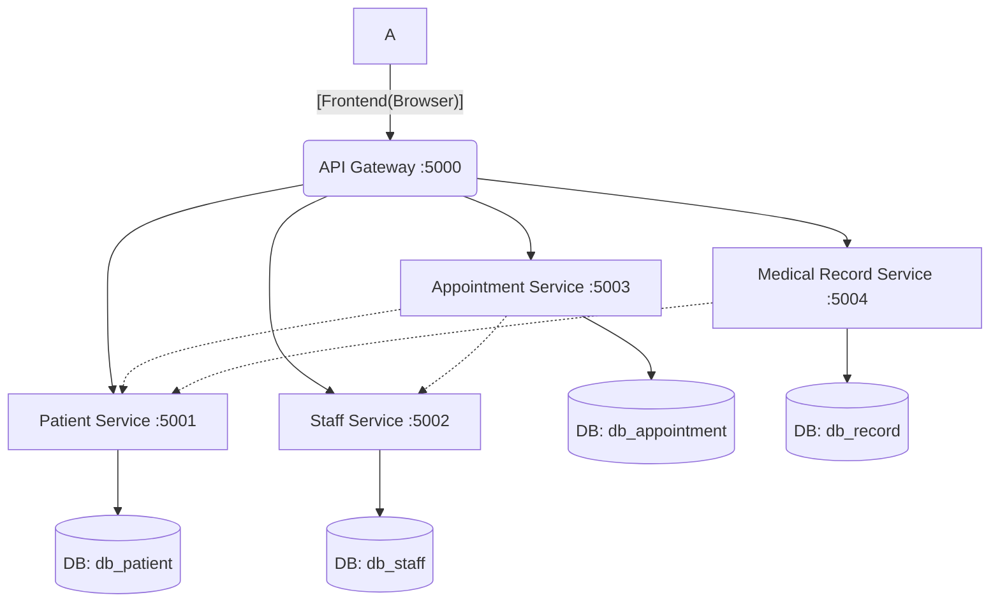

# Proyek UTS EAI: Smart Healthcare System

## 1. Deskripsi Singkat Proyek

Proyek ini adalah implementasi arsitektur *microservices* sederhana untuk sistem manajemen rumah sakit (Smart Healthcare System). Proyek ini terdiri dari 4 layanan *backend* independen (Patient, Staff, Appointment, Record), 1 API Gateway untuk autentikasi dan *routing*, dan 1 *frontend* web sederhana sebagai *consumer*.

Sistem ini memenuhi *requirement* untuk integrasi layanan, di mana *backend service* dapat saling memanggil untuk validasi data, dan *frontend* mengonsumsi semua data melalui *gateway* yang aman (JWT).

* **Topik:** Smart Healthcare System
* **Teknologi:** Python Flask, MySQL, Flask-JWT-Extended, HTML/CSS/JavaScript

---

## 2. Arsitektur Sistem

Arsitektur mengikuti pola `Client → API Gateway → Services → Database` yang diwajibkan.

* **Client (Frontend):** Aplikasi web statis (`login.html`, `dashboard.html`) yang hanya berkomunikasi dengan API Gateway.
* **API Gateway:** Bertindak sebagai pintu masuk tunggal (Port 5000). Bertanggung jawab untuk autentikasi (membuat token JWT di `/auth/login`) dan me-routing permintaan ke *service* yang sesuai.
* **Services:** 4 layanan independen yang masing-masing memiliki *database*-nya sendiri:
    * `patient-service` (Port 5001)
    * `staff-service` (Port 5002)
    * `appointment-service` (Port 5003)
    * `medical-record-service` (Port 5004)
* **Database:** 4 *database* MySQL logis terpisah (`db_patient`, `db_staff`, `db_appointment`, `db_record`).

### Diagram Alur



---
## 3. Cara Menjalankan

### A. Variabel Lingkungan (.env)

Pastikan file `.env` ada di *root* proyek dengan konfigurasi berikut:

```env
   # URL Database (Ganti 'root:' dengan user:pass Anda jika perlu)
   DATABASE_URL_PATIENT=mysql+mysqlconnector://root:@localhost:3306/db_patient
   DATABASE_URL_STAFF=mysql+mysqlconnector://root:@localhost:3306/db_staff
   DATABASE_URL_APPOINTMENT=mysql+mysqlconnector://root:@localhost:3306/db_appointment
   DATABASE_URL_RECORD=mysql+mysqlconnector://root:@localhost:3306/db_record
   
   # Kunci Rahasia JWT (Harus sama untuk semua)
   JWT_SECRET_KEY=kunci-rahasia-anda-yang-sangat-kuat
   
   # Alamat Port Service (Untuk Gateway & Integrasi Backend)
   PATIENT_SERVICE_URL=http://localhost:5001
   STAFF_SERVICE_URL=http://localhost:5002
   APPOINTMENT_SERVICE_URL=http://localhost:5003
   MEDICAL_RECORD_SERVICE_URL=http://localhost:5004
```

### B. Urutan Menjalankan

Urutan yang benar adalah menjalankan **semua *services*** terlebih dahulu, baru kemudian **API *Gateway***.


#### 1. Siapkan Database 💾

#### 2. Jalankan 4 Layanan (Services)

Buka **4 terminal terpisah** dan jalankan setiap layanan:

* **Terminal 1:** `python patient-service/app.py` (Port 5001)
* **Terminal 2:** `python staff-service/app.py` (Port 5002)
* **Terminal 3:** `python appointment-service/app.py` (Port 5003)
* **Terminal 4:** `python medical-record-service/app.py` (Port 5004)

#### 3. Jalankan API Gateway - 

* Buka terminal **ke-5**:
    * `python api-gateway/app.py` (Port 5000)

#### 4. Jalankan Frontend (Consumer) - 

* Buka file `frontend/login.html` **langsung di browser Anda**.

---
## 4. Anggota Kelompok & Peran 🧑‍💻

Berikut adalah pemetaan anggota kelompok dan *service* yang ditugaskan dalam proyek ini:

| Nama Anggota | NIM | Peran / Layanan yang Ditugaskan |
| :--- | :--- | :--- |
| (Muhammad Rakha Alfaruq) | (102022300368) | **API Gateway & Frontend**, Patient Service (Port 5001) |
| (Yudsitira Sebastian Saftari) | (102022300313) | Staff Service (Port 5002), Integrasi Backend |
| (Rajasyah Birra Munandar) | (102022300284) | Appointment Service (Port 5003), Database & Seed |
| (Devota Edra Athaloma) | (102022300344) | Medical Record Service (Port 5004), Integrasi Backend |

---
## 5. Ringkasan Endpoint API Gateway 📋

Semua permintaan *frontend* harus ditujukan ke endpoint **Gateway (Port 5000)** ini.

| Metode | Endpoint Gateway | Service Tujuan | Deskripsi |
| :--- | :--- | :--- | :--- |
| **POST** | `/auth/login` | (Gateway) | Login untuk mendapatkan token JWT. |
| **GET** | `/api/patients` | patient-service | Mendapat semua pasien. |
| **POST** | `/api/patients` | patient-service | Membuat pasien baru. |
| **GET** | `/api/patients/<id>` | patient-service | Mendapat satu pasien. |
| **PUT** | `/api/patients/<id>` | **patient-service** | **Memperbarui** data pasien. |
| **DELETE** | `/api/patients/<id>` | **patient-service** | **Menghapus** pasien. |
| **GET** | `/api/staff` | staff-service | Mendapat semua staf/dokter. |
| **GET** | `/api/staff/<id>` | staff-service | Mendapat satu staf/dokter. |
| **PUT** | `/api/staff/<id>` | **staff-service** | **Memperbarui** data staf/dokter. |
| **DELETE** | `/api/staff/<id>` | **staff-service** | **Menghapus** staf/dokter. |
| **GET** | `/api/appointments` | appointment-service | Mendapat semua janji temu. |
| **POST** | `/api/appointments` | appointment-service | **(Integrasi)** Membuat janji temu (validasi ke Patient & Staff). |
| **PUT** | `/api/appointments/<id>` | **appointment-service** | **Memperbarui** data janji temu. |
| **DELETE** | `/api/appointments/<id>` | **appointment-service** | **Menghapus** janji temu. |
| **GET** | `/api/records` | record-service | Mendapat semua rekam medis. |
| **POST** | `/api/records` | record-service | **(Integrasi)** Membuat rekam medis (validasi ke Patient). |
| **PUT** | `/api/records/<id>` | **record-service** | **Memperbarui** data rekam medis. |
| **DELETE** | `/api/records/<id>` | **record-service** | **Menghapus** rekam medis. |
